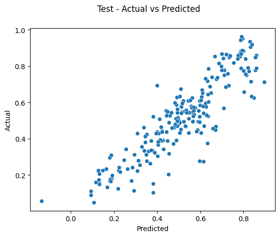

# BoomBikes - Linear Regression

Model the demand for shared bikes with the available independent variables.

---

## Table of Contents

- [General Info](#general-information)
- [Technologies Used](#technologies-used)
- [Conclusions](#conclusions)
- [Acknowledgements](#acknowledgements)

---

## General Information

BoomBikes, a US bike-sharing company, has incurred income losses as a result of the pandemic and wants to prepare for market recovery by researching the factors influencing demand for shared bikes. They have hired a consulting firm to analyze their dataset in order to identify the major variables that characterize the demand for shared bikes in the American market. The company wants to differentiate itself from other service providers and make a lot of money.

The goal is to create a demand model for shared bikes based on the relevant independent factors. The model will assist management in understanding how demand fluctuates with different features and will allow them to alter their business strategy to fulfill client expectations.

The target variable for the model is the _cnt_ variable, and it will also be useful in understanding demand dynamics in new markets.

### Datasets

- [Bike Rentals Data Set](https://ml-course2-upgrad.s3.amazonaws.com/Linear+Regression+Assignment/Bike+Sharing+Assignment/day.csv): This contains the bike rentals made in the year 2018 and 2019.
- [Data Dictionary](https://drive.google.com/file/d/1x4Vi_FF0DEmTN1Cf6BnPHUuQP9p0s0Pz/view?usp=sharing): This dataset describes the meaning of the variables mentioned in the Bike Rentals Data Set.

---

## Conclusions

We have selected 10 features for our model, and following are the results.

<table>
<tr><td style="vertical-align: baseline;">

| Features | p_value | t_value | VIF |
| --- | --- | --- | --- |
| spring | 0.008 | -2.654 | 1.994 |
| windspeed | 0.000 | -5.854 | 4.595 |
| temp | 0.000 | 14.423 | 3.838 |
| 2019 | 0.000 | 28.237 | 2.066 |
| summer | 0.000 | 4.350 | 1.903 |
| winter | 0.000 | 5.630 | 1.629 |
| MST | 0.000 | -8.938 | 1.549 |
| Sep | 0.000 | 5.566 | 1.229 |
| LRS | 0.000 | -11.444 | 1.081 |
| holiday | 0.000 | -3.668 | 1.043 |

</td><td style="vertical-align: baseline;">

|                | Train Set | Test Set |
| -------------- | --------- | -------- |
| R-Squared      | 0.832     | 0.804    |
| Adj. R-Squared | 0.829     | N.A.     |
| F-statistic    | 248.4     | N.A.     |

</td>
</tr>
</table>

---

## Technologies Used

Python 3.9.16

| Library      | Version |
| ------------ | ------- |
| pandas       | 1.4.4   |
| matplotlib   | 3.7.1   |
| seaborn      | 0.12.2  |
| statsmodels  | 0.13.5  |
| scikit-learn | 1.2.2   |

---

## Acknowledgements

- This assignment was done as a part of EPGP ML & AI, IIIT-B.
- [Data Set](https://ml-course2-upgrad.s3.amazonaws.com/Linear+Regression+Assignment/Bike+Sharing+Assignment/day.csv) and [Data Dictionary](https://drive.google.com/file/d/1x4Vi_FF0DEmTN1Cf6BnPHUuQP9p0s0Pz/view?usp=sharing) was provided by upGrad and IIIT-B.

---

Assignment done by: [Rahul Nanwani](https://github.com/rahul-nanwani)
